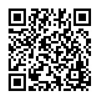

> ## ***Aisha Kanwal*** 
#### _Markdown CheetSheet_
___


# 1- Headings
How to give headings in markdown file?
# "For Heading 1, place "#" at the start of line." 
## "For Heading 2, place "##" at the start of line."
### "For Heading 3, place "###" at the start of line."
#### "For Heading 4, place "####" at the start of line."
##### "For Heading 5, place "#####" at the start of line."
###### "For Heading 6, place "######" at the start of line."

> We can only create 6 headings, if we place 7 #s heading 7 won't be created. try it at your end. 

# 2- Block of Words

For normal text in markdown, we simple start writing the statements as we do in our word or text documents.

> to create a block of text, put ">" at the start of the line. 

> if you want to add another block for another sentence, then make sure you have entered a black line in between two blocks of text.

> to make a whole block for the passage, put this ">" on each line of code without quotation marks
>
> I have added a ">" on above line and then enter to new line, at the start of this line i have added ">".

# 3- line breaks

this is how you can make a line break in markdown easily, simple add a '\' at the end of sentence and click enter to move on new line. \
this is a 2nd line

> we can break a line using \ - reverse slash or we can break a line by using double enter. 

# 4- combine two things
- block of words and headings

> # Heading 1 "To block, and heading, we know the symbols for both just write both symbols at the start of line 

# 5- Face of text
- Bold \
> **Bold** (in this we write " ** Bold ** " without spaces) \ 
> __Bold__ (in this we write " __ Bold __ " without spaces) \

- Italic \
> *Italic* (in this we write " * Italic * " without spaces) \
> _Italic_ (in this we write " _ Italic _ " without spaces) \

- Bold and Italic \
> ***Bold and Italic*** (in this we write " *** Bold and Italic *** " without spaces) \
> ___Bold and Italic___ (in this we write " ___ Bold and Italic ___ " without spaces) \


> we can use * starix or _ underscores to bold, italic or bold italic text. 

# 6- Bullet points/Lists

> Bullets
> - we can use -(dash), *(staric), or +(plus) signs to change the texts in bullets.
> + with +, upper space added wit " + "
> * with *, upper and lower spaces are added with " * " 
> - as seen in the block 


- Day-1 with " - "
- Day-2
- Day-3
- Day-4
- Day-5
    - Day-5a " tab and - "
        - sublisting (Anything) " double tab and - "
    - Day-5b
- Day-6
- Day-7

> Numbering

1. Day-1 with " 1. "
2. Day-2
3. Day-3
    1. Day-3a " tab and 1. "
    2. Day-3b
1. Day-4
1. Day-5
2. Day-6

# 7- line breaks or page breaks

This is page1. we can break pages with " --- " or " ___ " or " *** "

--- 
___
***
This is page2. 

> we break a line or page using 3 dashes -, or 3 underscores _, or 3 starix *. 

# 8- links and hyperlinks

To see the Asquare FaceBook Page [click here](https://www.facebook.com/Asquare0235)

> to click text (Hyperlink) to see the link we can put the specified text in square braces [ ] and exactly after square braces we put that link in round baces ( ) as shown above. 

<https://www.facebook.com/Asquare0235> 

> for clickable link we put link in between <> 

[Asquare YouTube Channel]:https://www.youtube.com/@asquare0235

> specify a name instead of pasting links repeatedly. \
> we can specify a key is square braces [ ] \
> put a : after sq: braces like [ ]: \
>put a link after :

> ## How we can use these keywords instead of links! 
> * How can we write hyperlinks 

\
To visit the Asquare Youtube Channel [click here][Asquare YouTube Channel]

> for using keywords instead of links we use 2 square braces. \
> in 1st sq braces [ ] we write clickable word(s)\
> in 2nd sq braces [ ] we write the keyword used for the link.

# 9- Images and Figures with Link

To subscribe ASQUARE youtube Channel, scan the QR code:

<!--  -->

> agr hamare pas local directory m hain jpeg/png files then we will use the above given command \
> To show the image we use exclamanation sign first ! \
> Then, we use a keyword is sq: braces [ ] \
> In last, we put the name with extension in round braces ( )
> to make a link for QR code we do:
>> [QR](QR.jpeg) \
> we remove ! from the whole command. 

>>> Task: \
> How to comment out a markdown line? and its shortcut!

>**Ques:** How to comment out a markdown line? and its shortcut? \
**Ans:**  by using the tag <!-- text --> \
shortcut is ctrl+/

> ## Online images

[Google Logo](https://www.google.com/url?sa=i&url=https%3A%2F%2Fblog.hubspot.com%2Fmarketing%2Fgoogle-logo-history&psig=AOvVaw1uUauArd5Bt4htsA29MFF3&ust=1674838185612000&source=images&cd=vfe&ved=0CA8QjRxqFwoTCNCh38vY5fwCFQAAAAAdAAAAABAE)

> To use hyperlink we simply use a keyword in sq: braces and a link in round braces. 


> To show the image we do the same command with an exclamanation in front of the command

# 10- Adding code or code block

To print a string use `print("Asquare")`

`print("Hello world!")`

> To show the code in text we use back comma ` in the start and end of the text as shown above. 

> This code will show colors according to Python language syntax

```Python
x = 5+6
y = 3-2
z = x+y
print(z)
```
> This code will show colors according to R language syntax

```R
x = 5+6
y = 3-2
z = x+y
print(z)
```

> To make a block of code we use 3 ( ``` ) in the start and 3 in the end.
> another point is: we can specify out prpgramming language in with starting 3 ` as shown above. 
> when we write Python, R, html etc colors of the code will be changed according to that language. 

# 11- Adding tables
> we use pipe ( | ) to make a table

> for left alignment we use colon : on left hand side of dashes like :---- \
> for right alignment we use colon : on right hand side of dashes like ----: \
> for mid alignment we use colon : on both sides of dashes like :----:

| species | petal_length | sepal_lenth|
|----|:----:|:----:|
|virginica | 18.2 | 19.2|
|setosa | 15.1 | 17.2 |
|versicolor | 12.2 | 12.2 |
|virginica | 18.2 | 19.2|
|setosa | 15.1 | 17.2 |
|versicolor | 12.2 | 12.2 |

# 12- Contents

[1- Headings](#1--headings)\
[2- Block of words or Citations](#2--block-of-words)\
[3-  Line breaks](#3--line-breaks)\
[4- Combine two things](#4--combine-two-things)\
[5- Face of text](#5--face-of-text)\
[6- Bullet pointlists](#6--bullet-pointslists)\
[7- Line breaks or page breaks](#7--line-breaks-or-page-breaks)\
[8- links and hyperlinks](#8--links-and-hyperlinks)\
[9- images and figues with link](#9--images-and-figures-with-link)\
[10- adding code or code block](#10--adding-code-or-code-block)\
[11- adding tables](#11--adding-tables)


# 13- Install Extensions

**Sample Text**

**Bold**

_Italic_

**_Bold and Italic_**

[Edinbrugh Trip Vlog](https://www.youtube.com/watch?v=cTNsgcG19CU)


>Strikethrough text

~~Image~~

> Block of code

```

Image
```

> Checkboxes (for checkbox, we write - [ ] at the start of line)
- [ ] Asquare Instagram Page
- [ ] Asquare YouTube Channel
- [ ] Asquare Facebook Channel

> inline code (put text in between single ` mark)

`Hello World!`

> Adding table format by right clicking.  


Column A | Column B | Column C
---------|----------|---------
 A1 | B1 | C1
 A2 | B2 | C2
 A3 | B3 | C3

> Adding table with header 


Column A | Column B | Column C
---------|----------|---------
 A1 | B1 | C1
 A2 | B2 | C2
 A3 | B3 | C3
